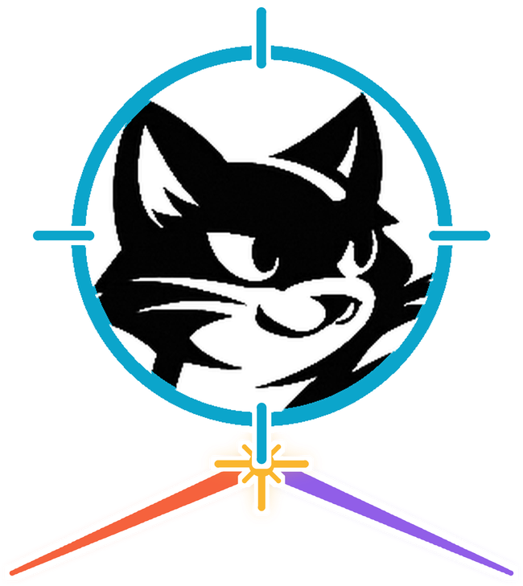
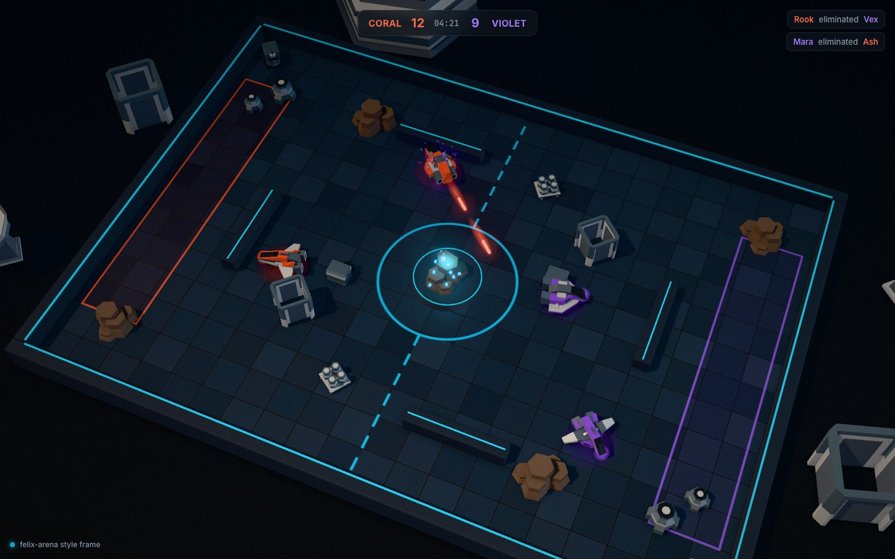

<p align="center">
  
</p>

<h1 align="center">Felix Arena</h1>

<p align="center">
  A browser arena game built on <a href="https://github.com/gabloe/felix">Felix</a>.
</p>

<p align="center">
  <a href="LICENSE"></a>
</p>

Felix Arena is a team deathmatch for up to eight players, Coral against
Violet, flying low-poly hover-craft in a walled arena seen from a tilted
top-down camera. When you die, the last few seconds replay from your view,
your killer's, or a camera that orbits the fight, and spectators can join a
match in progress. It is for people who want a small multiplayer game they can
host themselves, and for game developers evaluating Felix as the backend for
live play, spectating and replays. The project is at the design stage: there
is a design, an art direction and a style frame, and no game code yet.

In the design, each arena's simulation commits every tick to a durable Felix
stream as an
[atomic commit](https://github.com/gabloe/felix/blob/main/docs/atomic-commit.md),
and every 30th tick also updates a stream state key that points at it as a
keyframe. Players and spectators join by reading that key and subscribing from
its offset, and the kill cam is a read of the same stream from an offset named
in the kill event. Inputs go on an in-memory stream with
[drop-new delivery](https://github.com/gabloe/felix/blob/main/docs/semantics.md#delivery-to-subscribers),
presence and the lobby are
[cache](https://github.com/gabloe/felix/blob/main/docs/cache-on-log.md) keys with
a TTL, and who may play or watch is a Felix RBAC role, enforced through tokens
the control plane
[narrows](https://github.com/gabloe/felix/blob/main/docs/auth.md#control-plane-token-exchange-flow)
to one arena. Tick streams are replicated across three brokers, so a match can
continue after its broker
[fails](https://github.com/gabloe/felix/blob/main/docs/semantics.md#failover).



## Features

Nothing is playable yet. What exists today is the style frame, one HTML page
that renders a moment of a match in the final look: the arena, two teams of
craft from Kenney's Space Kit, bolts, hits, the centre crystal, the lighting
and the post processing. It is the reference every later milestone is built
against.

## Quick start

The style frame loads Three.js from jsDelivr, so it needs a network connection
and any static file server. Serve the `prototype` folder and open it:

```bash
cd prototype && python3 -m http.server 8000
# open http://localhost:8000/style-frame.html
```

Drag to orbit the camera. Add `?t=1.2` to the URL to freeze the action at that
moment.

## How it works

Three of the project's own processes will sit around Felix: the browser
client, a stateless gateway that bridges WebSocket to Felix's QUIC protocol,
and a Rust simulation that is the single authority for each arena, stepping it
at 30 Hz. The game rules live in one Rust crate, linked by the simulation and
compiled to WebAssembly for the browser's prediction, so the two cannot
disagree about the rules.

| What | Felix primitive | Name |
|---|---|---|
| Ticks: the match | Durable stream, 1 shard, `Quorum`, 3 replicas | `arena.ticks.<arena>` |
| Latest keyframe | Stream state key on the tick stream | `keyframe` |
| Match start offsets | Stream state keys on the tick stream | `match/<n>` |
| Player inputs | Ephemeral stream | `arena.input.<arena>` |
| Who is connected | Cache keys with TTL | `arena.members.<arena>/<session>` |
| Simulation epoch | Counter | `arena.epoch.<arena>/sim` |
| Lobby: every arena's status | Cache keys with TTL | `arena.lobby/<arena>` |
| Who may play, who may watch | Felix RBAC roles | `role:arena-<arena>-play`, `role:arena-<arena>-watch` |

[docs/design.md](docs/design.md) has the full design, including the tick
format, joining mid-match, the kill cam, prediction and failure modes. Its
section
[How multiplayer games are normally built](docs/design.md#how-multiplayer-games-are-normally-built)
compares this with the usual way of building a session-based game.

## Status

The design and art direction are written and the style frame is done. M0,
locking the look in a real app, is next. Each milestone is a
[GitHub milestone](https://github.com/gabloe/felix-arena/milestones) with an
issue per piece of work.

| M | Milestone | Status |
|---|---|---|
| [0](https://github.com/gabloe/felix-arena/milestone/1) | The look, locked | Next |
| [1](https://github.com/gabloe/felix-arena/milestone/2) | A browser reaches Felix | Planned |
| [2](https://github.com/gabloe/felix-arena/milestone/3) | One authority | Planned |
| [3](https://github.com/gabloe/felix-arena/milestone/4) | Join mid-match | Planned |
| [4](https://github.com/gabloe/felix-arena/milestone/5) | The kill cam | Planned |
| [5](https://github.com/gabloe/felix-arena/milestone/6) | Isolation and gaps | Planned |
| [6](https://github.com/gabloe/felix-arena/milestone/7) | Per-arena sign-in | Planned |
| [7](https://github.com/gabloe/felix-arena/milestone/8) | Scale and failover | Planned |
| [8](https://github.com/gabloe/felix-arena/milestone/9) | Self-hosting | Planned |

## Documentation

- [docs/design.md](docs/design.md): the game, the architecture, the data model, the kill cam, failure modes, targets and the build order.
- [docs/art.md](docs/art.md): the art direction, from the palette and lighting to the rules that keep new content consistent.
- [prototype/assets/CREDITS.md](prototype/assets/CREDITS.md): the sources and licences of the models and the HDRI.

## Contributing

[CONTRIBUTING.md](CONTRIBUTING.md) describes how code, art and pull requests
should read.

## License

MIT. Models and the HDRI are CC0; see [prototype/assets/CREDITS.md](prototype/assets/CREDITS.md).
