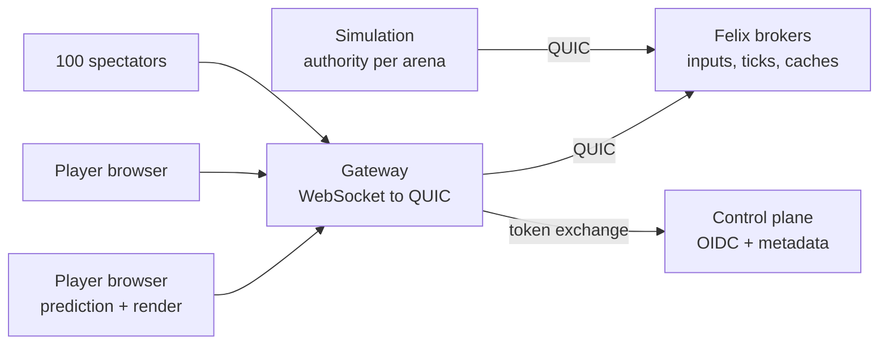
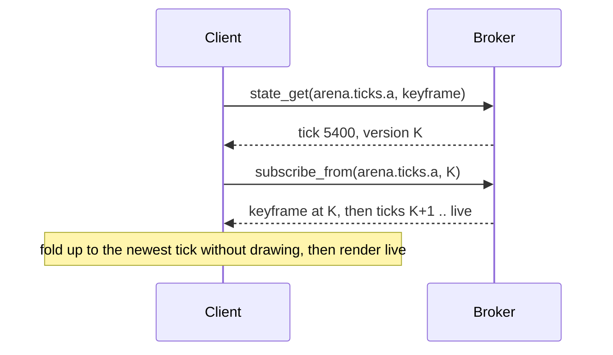
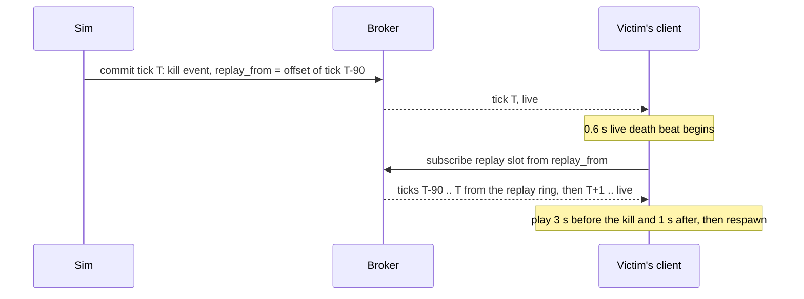

# Felix Arena design

A browser arena game whose entire backend is [Felix](https://github.com/GetFelix/felix).
Small hover-craft fight in a walled arena, seen from a tilted top-down camera.
Every match is a durable Felix stream, and the headline feature falls out of
that: after a kill, the last few seconds replay from the match's log, from the
victim's view, the killer's view, or a camera that orbits the fight.

It exists to argue what [felix-canvas](https://github.com/GetFelix/felix-canvas)
argues for documents, in a domain where latency is felt in the hands: that one
log can be the live feed, the spectator broadcast, the replay system and the
crash recovery at once. The audience is a game developer who would otherwise
run a game server fleet, a relay tier for spectators, a demo-file pipeline for
replays and Redis for presence, and does not believe one system covers them.

How it looks is in the art direction note, [art.md](art.md), and the style
frame it describes, [prototype/style-frame.html](../prototype/style-frame.html).

**In scope**

- One mode, team deathmatch, in persistent arenas that run match after match
- An authoritative simulation, with client-side prediction for your own craft and interpolation for everyone else's
- A kill cam replayed from the log, from three views, and any kill in the feed replayable later
- Spectators who join a match in progress, in numbers
- Sign-in with the deployment's own identity provider; play and watch as separate grants
- A deliberate slow-client lane, because isolation only convinces when you can watch it work

**Out of scope**

- Matchmaking, ranks, parties, friends and chat
- More than one mode, more than two weapons, or maps beyond a small fixed set
- Touch controls. Phones watch and replay; playing needs a keyboard and mouse or a gamepad
- Anti-cheat beyond what server authority gives for free
- Lag compensation (rewinding hitboxes); see Interpolation and prediction for why projectiles make it unnecessary at first
- Anything that needs a second datastore. If a feature cannot be expressed in streams, stream state, caches and counters, it is out by definition

## The game

| | |
|---|---|
| Mode | Team deathmatch, two teams, Coral and Violet |
| Players | 2 to 8 per match, up to 4 a side |
| Length | 5 minutes or first team to 25 kills, after a 10 second warmup; 15 seconds of results, then the next match |
| Craft | One hover-craft model per player from the Kenney Space Kit, team colour on its accent panels; 100 health, regenerating after 4 seconds without damage |
| Respawn | 5 seconds, at your team's spawn zone. The kill cam fills that wait |
| Arena | 40 by 28 metres, walled, point-symmetric cover so neither side is better |

**Controls.** WASD or the left stick moves; the craft strafes, so it always
faces where you aim. The mouse or the right stick aims. Left click or the right
trigger fires. Space or the left trigger boosts: a short dash with a 3 second
cooldown. Tab shows the scoreboard. During a kill cam, 1, 2 and 3 switch between
the victim, killer and orbit views, and Space skips to the respawn.

**Weapons, kept to two.**

| Weapon | Behaviour | Why it is here |
|---|---|---|
| Blaster | Default. A bolt at 30 m/s, 12 damage, 6 shots a second | A projectile with travel time is visible in replays and forgiving of latency |
| Rail | Picked up from the centre crystal, which spawns one every 30 seconds. Charges for 0.5 s, then a hitscan beam for 70 damage; 3 shots | One high-stakes moment per half minute, which is what makes a kill cam worth watching |

## Success criteria

The project succeeds if five demonstrations work in front of a skeptic.

| # | Demonstration | Passes when |
|---|---|---|
| 1 | Kill cam | After a kill, the victim's screen is playing the replay within 800 ms of the kill's tick being committed, every time. The replay's records are fetched in under 250 ms p95. Two browsers replaying the same kill hash identical tick bytes |
| 2 | Join mid-match | A spectator opening a match in progress draws a correct frame in under 500 ms p50, and its state hash at a given tick matches a player's |
| 3 | Slow client isolation | One player throttled to 256 kbit/s falls behind alone and says so; the others' tick latency stays within 10% of the run without them, and the throttled one recovers from a keyframe |
| 4 | Survive broker loss | Kill the broker owning the arena's tick stream mid-match. Play resumes on the new owner with no acknowledged tick lost, and a kill cam whose window spans the failover still plays |
| 5 | Spectator fanout | 100 spectators on one match. Players' tick latency p50 stays within 10% of the run with none, and the simulation's commit latency stays flat |

Two criteria are deliberately absent. Player count is not a goal: an arena
holds 8, and a hundred-player battle royale would be a different design. Nor is
the number of concurrent matches: one arena is one stream shard, and many
arenas spread across the cluster by name, which is Felix's ordinary job.

## How multiplayer games are normally built

Nothing about the game's netcode is new. The authoritative server with client
prediction and entity interpolation is the model Quake popularised and Source,
Overwatch and Valorant refined. What is unusual is the layer underneath.

A session-based action game is normally built from these parts:

- **A dedicated game server per match.** It owns the match state in memory, reads client inputs over UDP, steps a fixed tick (Fortnite at 30 Hz, Overwatch at about 63, Valorant at 128) and sends each client snapshots or deltas.
- **A fleet allocator** such as Agones on Kubernetes, to place match servers and route players to the right one.
- **A relay tier for spectators.** Valve's GOTV and its relays rebroadcast a delayed copy of the match, because a game server cannot fan out to thousands of viewers itself.
- **A kill cam kept in memory.** Either the client records the last few seconds it received, or the server keeps a ring of recent snapshots and sends the right slice.
- **Demo files for replays,** recorded by the server and uploaded after the match.
- **Redis or similar** for presence, lobbies and the server list; **Kafka** for match telemetry, added later.

Browser games swap UDP for WebSocket and the dedicated server for a Node
process (Colyseus, Socket.IO), but keep the same shape. The stack works, and
most online games you have played sit on it. Its seams are in known places:

**A match lives in one process's memory.** If the game server crashes, the
match is gone. Nothing outside it holds the state at a known point.

**The kill cam, the spectator feed and the replay are three copies.** A
client-side kill cam shows what that client received, holes and all, so two
players can see different replays of one kill. Spectators get a separate
relayed stream. Replays come from a file that exists only after the match ends.

**Joining mid-match is a special message.** The server builds a full state for
the newcomer, separately from the stream everyone else is on.

**Fanout is the game server's problem.** Every spectator is one more socket the
simulation process has to serialise for, which is why relays exist.

### What changes when the substrate is a log

Here the simulation commits each tick to one durable stream per arena, and
everyone reads that stream. The seams above become properties of the broker.

| Seam | Usual stack | Here |
|---|---|---|
| Match state on a crash | Lost with the process | Recovered from the last keyframe in the log; the match pauses and continues |
| Kill cam | A buffer per client or per server | A read of the log from a named offset, identical for every viewer |
| Spectators | A relay tier | More subscribers on the same stream, encoded once, isolated per subscriber |
| Replays | A demo file, after the match | The same log, readable any time within retention |
| Joining mid-match | A special full-state message | `state_get` for the keyframe's offset, then subscribe from it |
| A dropped update | Invisible over unreliable transport | A gap in offsets, which the client can fill |
| Failover | Lose the match | Shard ownership under a lease, already the broker's job |

**What it costs.** The trade runs both ways:

- **More hops.** A dedicated server talks to the client directly. Here an input goes browser, gateway, broker, simulation, and the tick comes back simulation, broker, gateway, browser. Felix's share is a few milliseconds in-region; the budget below holds it to that.
- **TCP for the browser.** The gateway speaks WebSocket, so a lost packet stalls everything behind it. Input redundancy and an interpolation buffer absorb most of it. WebTransport datagrams for inputs are the later fix.
- **Durability on the hot path.** Every tick is a log record. At 30 ticks a second that is cheap, but it is not free, and it is why the tick rate is 30 and not 60.
- **The gateway is the trust boundary for who sent an input,** because a Felix event does not carry its publisher (see Felix gaps).
- **One arena is one shard is one owning broker,** the same single-owner constraint as one game server per match, with failover the broker already has.

## Architecture

Three process types of our own sit around Felix: the browser client, a
stateless gateway that bridges WebSocket to Felix's QUIC protocol
([felix-gateway](https://github.com/GetFelix/felix-gateway)), and the
simulation that is the authority for each arena.

| Component | Language | Holds state? | Responsibility |
|---|---|---|---|
| Client | TypeScript, Three.js, the `core` crate as WebAssembly | A view of the match | Render, predict own craft, interpolate others, kill cam playback |
| Gateway | Rust, `felix-client` | No | Browser transport, token exchange and narrowing, frame relay, stamping the sender on inputs |
| Simulation | Rust, `core` + `felix-client` | Yes, but recoverable from the log | Step each arena at 30 Hz, commit ticks, decide every hit and kill |
| Brokers | Felix | Yes, authoritative | Tick log per arena, input streams, keyframe state, caches |
| Control plane | Felix | Yes, metadata | Token exchange against the IdP, arena registration, RBAC |

### Who is authoritative

The simulation is. Each arena has exactly one simulation task, which reads
every player's inputs from Felix, steps the world, and commits the result. The
gateway stays a relay, as in felix-canvas.

The alternative was client authority with validation: each client simulates its
own craft and publishes its position, and something checks the claims. It was
rejected:

- **Hits need one judge.** Two clients that disagree about whether a bolt hit need a third party to decide. That third party is a simulation, so the design would have one anyway, only smaller and more awkward.
- **The kill cam must be the truth.** A replay assembled from what each client claimed shows what each client believed. A replay of the authority's ticks shows what happened.
- **Validation is half a simulation.** Checking that a move was possible means running movement and collision with the client's inputs, which is most of the work of simulating.
- **Cheating is a one-line change otherwise.** With client authority, a modified client publishes any position it likes.

Client authority would save one hop for your own movement. Prediction gets the
same feel back without giving up the authority.

### The simulation process

One `sim` process runs many arenas, each a task on its own 30 Hz timer. Arenas
are spread over the configured sim replicas by rendezvous hashing on the arena
name, the way rooms spread over brokers, so no coordinator is needed. A replica
that restarts takes its arenas back from the log (see Failure modes).

The rules (movement, collision, projectiles, damage, the match clock) and the
tick encoding live in one Rust crate, `core`, with no I/O. The sim links it
natively. The browser loads the same crate compiled to WebAssembly, for
prediction and for decoding ticks. This is felix-canvas's "write logic once"
rule: there, `model/` is shared by the browser and the snapshotter; here,
`core/` is shared by the browser and the sim, so a prediction can only
disagree with the authority through timing, never through a second copy of the
rules.

### Tick rate

The sim steps and commits at **30 Hz**.

- A top-down game with projectiles is forgiving. Bolts travel at 30 m/s, so a 33 ms tick moves one a metre, which interpolation hides. Fortnite ships at 30 Hz.
- Every tick is a durable record. 30 Hz keeps an arena at about 9 KB/s of log and each viewer at about 9 KB/s of WebSocket traffic.
- Each tick's commit must finish before the next one starts (see Ticks are commits). A commit in-region takes a few milliseconds, so 33 ms leaves room for a slow one.

60 Hz would halve the interpolation delay and double everything else. It is a
setting, not a redesign, and worth measuring once M7's numbers exist.

### Data model

Everything is scoped `(tenant, namespace, name)`. An arena is a persistent room
that runs match after match, so its streams are created once, at deployment,
and never per match. That sidesteps the lack of an all-or-nothing create
([felix#967](https://github.com/GetFelix/felix/issues/967)).

| What | Felix primitive | Name | Durability |
|---|---|---|---|
| Ticks: the match | Durable stream, 1 shard, `Quorum`, 3 replicas | `arena.ticks.<arena>` | Log-backed, until broker-wide retention trims it |
| Latest keyframe | Stream state key on the tick stream | `keyframe` | Written atomically with the keyframe tick |
| Match start offsets | Stream state keys on the tick stream | `match/<n>` | Same |
| Player inputs | Ephemeral stream | `arena.input.<arena>` | None, at most once by design |
| Who is connected | Cache keys with TTL | `arena.members.<arena>` / `<session>` | TTL 30 s, refreshed every 10 s |
| Simulation epoch | Counter | `arena.epoch.<arena>` / `sim` | Log-backed |
| Lobby: every arena's status | Cache keys with TTL | `arena.lobby` / `<arena>` | TTL 10 s, refreshed by the sim |
| Who may play, who may watch | Felix RBAC roles | `role:arena-<arena>-play`, `role:arena-<arena>-watch` | Control plane store |

**Inputs and ticks are separate streams.** They have opposite needs. An input
40 ms old is worthless and the next one supersedes it, so inputs go on an
ephemeral stream, fire and forget. A tick is the match's history and must
never be lost, so ticks go on a durable stream with `Quorum` consistency.

**One arena is one shard.** A match needs one total order of ticks, and Felix
orders records within a shard.

### Inputs

A client sends one input record per tick, about 20 bytes: a sequence number,
the move vector, the aim angle and the buttons. Because the stream is at most
once, each record also repeats the previous two inputs, so a lost record is
almost always covered by the next.

**The gateway stamps the sender.** A Felix event does not say who published it
(`Event` in `crates/sdk/felix-client/src/subscribe.rs:156` carries the stream,
payload, offset and skip count, nothing about the publisher). So the gateway
prefixes each input with the session's Felix principal, which it learned from
the token exchange, and passes the rest through unread. Browsers never hold a
Felix token and cannot reach the brokers, so only a gateway can publish to the
input stream, and a client cannot speak for another player. This moves one
trust decision into the gateway, which felix-canvas avoided; it is listed as a
Felix gap below, and the fix belongs in the broker.

The sim keeps the newest input per player and applies it at each tick. A
player whose inputs stop is held on the last one for 100 ms, then coasts.

### Ticks are commits

Each tick is one atomic commit on the tick stream (`Client::commit`,
`crates/sdk/felix-client/src/client/commit.rs`; semantics in Felix's
`docs/atomic-commit.md`). Three properties make commit the right call rather
than a plain publish:

1. **The answer carries the offset.** `CommitOk { offset }` comes back on every commit. A plain acked publish returns its offset only when the whole broker runs with ack-on-commit ([felix#956](https://github.com/GetFelix/felix/issues/956)); the sim needs the offset of every tick for the kill cam, without making every stream on the broker pay for it.
2. **A keyframe and its pointer land together.** Every 30th tick is a keyframe, and its commit also writes the stream state key `keyframe`. A reader of that key gets the keyframe's offset as the value's version, and on a `Quorum` stream a state read never reflects a commit a failover could take back.
3. **Order.** The sim waits for each commit's answer before sending the next, so ticks land in tick order. A commit takes a few milliseconds in-region, well inside the 33 ms tick.

A tick record holds the whole dynamic state, so any single tick can be drawn
without the ones before it:

| Part | Contents | Size |
|---|---|---|
| Header | Epoch, match number, tick number, keyframe flag | 12 bytes |
| Crafts | Per craft: slot, position and velocity (centimetres, 16-bit), heading, health, flags, last input sequence applied | 16 bytes each |
| Projectiles | Per live bolt: id, owner, position, heading | 9 bytes each |
| Events | Hits, kills, spawns, pickups, with whatever each needs | Varies |
| Keyframe only | Roster (names, teams), scores, match clock, pickup timers | About 200 bytes |

A busy tick with 8 crafts and 30 bolts is about 450 bytes; a typical one is
under 300. A 5-minute match is about 3 MB of log.

**Events are in the tick that caused them.** A kill is not a separate record:
it is an event in the tick where the health reached zero, so it shares that
tick's offset and can never be seen out of order with the state it describes.

### Joining mid-match

A player or spectator reads the `keyframe` state key, whose version is the
keyframe's offset `K` (`StateValue.version`, see `docs/atomic-commit.md`), and
subscribes from `K`. The first event is the keyframe, followed by at most 29
ticks of catch-up, then live ticks. The client applies the catch-up without
drawing it and starts rendering at the newest tick.

felix-canvas's rule is subscribe before you read, because its snapshot is a
separate value and ops published during the fetch would be lost. Here the
keyframe is in the log, so a subscription from its offset is continuous into
live delivery by construction. The broker registers the live subscription
before reading history (`crates/server/felix-broker/src/broker/subscribe.rs`,
the comment on `subscribe_from`), which is exactly the ordering felix-canvas
does by hand.

A player who joins also writes its member key and sends a `join` input. The
sim assigns a team and slot and announces it in the next tick's events. No two
clients ever race for a slot, because only the sim writes the roster.

### The gateway

The gateway is [felix-gateway](https://github.com/GetFelix/felix-gateway), the one felix-canvas uses,
with a game-shaped protocol. It keeps that gateway's rules: it holds no game state, never reorders anything, opens
one Felix connection per browser session with that session's narrowed token,
and is the place the browser's WebSocket ends. It differs in three ways:

- **Binary frames for events.** Ticks go to the browser as binary WebSocket messages, an offset plus the payload. JSON with base64, as felix-canvas uses, would cost a third more bytes and a parse per tick.
- **Two subscription slots per connection on the tick stream:** `live` and `replay`, so a kill cam never disturbs the live view.
- **The sender stamp** on inputs, above.

The [throttle](https://github.com/GetFelix/felix-gateway/blob/main/docs/protocol.md#throttle)
message carries over unchanged, for demonstration 3.

**Latency budget, in-region, one way, p50:**

| Leg | Budget |
|---|---|
| Browser to gateway | The network: 10 to 40 ms on the internet, under 1 ms in the dev stack |
| Gateway to broker, input publish | 1 ms |
| Broker to sim, input delivery | 1 ms with the low-delay batching settings |
| Wait for the next tick | 0 to 33 ms, 17 on average |
| Sim step | Under 2 ms |
| Commit, including `Quorum` replication | 3 ms |
| Broker to gateway, tick delivery | 1 ms |
| Gateway to browser | The network |
| Interpolation delay for other crafts | 67 ms, two ticks, adapting up to 100 ms on jittery links |

Felix and the gateway together are budgeted at under 6 ms of the server-side
path. felix-canvas measured broker delivery at 5.9 ms p50 under default
batching against 190 µs under the latency profile, so the dev stack and the
deployment settings set `event_batch_max_delay_us` and
`subscriber_flush_max_delay_us` low. They must not copy the rest of that
profile: it uses `subscriber_queue_policy: block` (`docs/broker-config.md`,
"Latency Optimized"), which would let one slow spectator hold up fanout to
everyone. Arena keeps `drop_new`, the default. The policy is broker-wide
(`FELIX_SUB_QUEUE_POLICY`, `services/felix-broker-service/src/config/env.rs:240`),
not per stream.

Instrument every leg separately from the first milestone, so that the instinct
to blame the broker can be settled with data.

## The kill cam

The kill cam is a read of the tick stream from a named offset, played back
through the same renderer with a different camera.

**Finding the right offset.** The sim keeps a ring of `(tick, offset)` for the
last 10 seconds, filled from each commit's answer. When a kill happens at tick
`T`, the kill event names `replay_from`, the offset of tick `T - 90` (3 seconds
earlier). The client does no arithmetic on offsets. Offsets are not one per
tick: after a failover the new leader's generation-start record takes an offset
(`Event::skipped_before` in `crates/sdk/felix-client/src/subscribe.rs`), and
a retried commit can land twice. The sim knows each tick's real offset, so it
names it.

**Reading it.** The client sends `subscribe` on its `replay` slot from
`replay_from`. Felix serves recent records from each stream's in-memory replay
ring, 1,024 records by default (`DEFAULT_LOG_CAPACITY`,
`crates/server/felix-broker/src/broker.rs:47`), which at 30 Hz is 34 seconds.
A kill cam therefore reads memory, not disk. Older kills, replayed from the
feed, read the log through the segment reader. The subscription carries on
into live ticks, which supplies the second after the kill; the client closes
it once it has tick `T + 30`. Felix has no bounded range read, so the replay
holds a live subscription for those few seconds (see Felix gaps).

**Playing it.** The window is 3 seconds before the kill and 1 second after:
120 ticks, about 40 KB. The replay world is a second instance of the client's
world state, fed by the replay subscription and drawn by the same scene. The
live world keeps updating underneath, so leaving the kill cam is instant. The
last half second before the kill plays at half speed, then the hit, then the
explosion at full speed.

**Views.** A tick holds every craft's position, heading and aim, so any camera
works:

| View | Camera |
|---|---|
| Victim (default) | The game camera, centred on the victim, with the killer outlined |
| Killer | The game camera, centred on the killer, so you see what they saw coming |
| Orbit | A cinematic camera circling the midpoint of the two, lower and closer than the game camera, slowing as the killing shot lands |

**Timing.** The victim sees the kill live and gets a 0.6 second death beat (the
explosion, the camera easing in) before the replay starts. The fetch runs
inside that beat: one round trip to the gateway plus 90 records from the
broker's memory. On a 40 ms link that is about 100 ms, so the replay is
buffered before it is needed. The target is a fetch under 250 ms p95 and the
replay on screen within 800 ms of the kill's commit.

**Every viewer sees the same replay.** The replay is the bytes in the log, not
whatever each client happened to receive, so a spectator, the killer and the
victim replaying one kill see the same ticks. Demonstration 1 checks this by
hashing the tick payloads each browser read. A client that dropped live ticks
still gets a complete replay, because the replay is a fresh read.

The alternative, playing the kill cam from the client's own recent buffer, was
rejected for that reason. It would save the fetch, but a client that dropped
ticks under load, or joined two seconds ago, would show a different or broken
replay, and the headline feature would stop demonstrating anything about the
log.

**Replays from the feed.** Each kill in the kill feed carries its
`replay_from`, so any viewer can replay any kill of the match, or of earlier
matches through the `match/<n>` state keys, for as long as retention keeps the
log. Felix keeps durable logs until a broker-wide limit trims them, and
per-stream retention is not applied yet
([felix#964](https://github.com/GetFelix/felix/issues/964)). A replay whose
offset has been trimmed is refused as `CursorTooOld`, and the client says
"Replay no longer available".

**Cost.** One kill cam is one subscription and about 40 KB out of the broker's
memory. A match with 8 players averages about one kill every 6 seconds, so the
victim's replays add well under 10 KB/s per arena. If every spectator also
watched every kill, 100 spectators would add about 700 KB/s across the
gateway, which is still less than the live ticks.

## Interpolation and prediction

**Your own craft is predicted.** The client applies each input locally at once
through `core`'s movement code, and keeps the inputs the sim has not yet
confirmed. Each tick says which input sequence the sim last applied for each
player. The client resets its craft to the sim's state, replays the
unconfirmed inputs on top, and if the result differs from what is on screen,
blends the difference out over 100 ms. With the same rules on both sides, this
only corrects for timing and collisions with other crafts.

**Your own shots are predicted too.** A bolt appears from your nose when you
click. When the sim's bolt for that input arrives, the client swaps its local
bolt for the real one, matched on `(player, input sequence)`. A shot the sim
rejected, because you were already dead, fades out.

**Everyone else is interpolated.** Other crafts and bolts are drawn between the
two ticks around a render time that runs two ticks (67 ms) behind the newest
received. The buffer grows to 100 ms when arrival jitter rises. One or two
missing ticks are bridged by interpolating across them.

**No lag compensation.** Rewinding hitboxes to what the shooter saw matters for
hitscan weapons with small targets. Blaster bolts travel and are judged by the
sim when they arrive, so what you see is what the sim decides. The rail is
hitscan; it gets a generous 0.6 m beam radius instead of a rewind. If playtests
show rail shots being stolen by latency, rewinding the sim's last 200 ms of
craft positions is a contained change in `core`.

**Spectators and the kill cam do not predict.** They have no inputs. Both run
the interpolator over ticks only, which keeps replays the same for everyone.

## Rendering

The look is set by the style frame and [art.md](art.md). This section is about
keeping it at 60 frames a second.

**Pipeline.** Three.js `WebGLRenderer`, chosen over WebGPU for reach today. One
directional key light casts every shadow (one 2048 shadow map, PCF soft); a
hemisphere fill, an environment map from a 1k Poly Haven HDRI prefiltered once
with PMREM, and a few pooled point lights for muzzle flashes and hits. Post
processing runs in half-float: ground-truth ambient occlusion (`GTAOPass`),
bloom at half resolution, the output pass for tone mapping (Khronos PBR
Neutral, which keeps the palette's hues), then a vignette. Glow effects are
excluded from the occlusion pass so they never darken what they light.

**Scene structure.**

- The arena is static: walls, floor and cover are merged into a few meshes per material when it loads.
- Repeated props are `InstancedMesh`.
- Crafts are at most 8 small models of a few hundred triangles each.
- Bolts are one `InstancedMesh` of up to 64, and their glow halos another.
- Sparks are one pooled `Points` system; bursts and debris come from fixed pools, so nothing allocates during a match.
- Point lights are a fixed pool of 3 whose intensity changes, never their number, because a change in light count recompiles shaders.

**Budget at 1080p on a laptop iGPU (Intel Iris Xe, Apple M1), 16.7 ms a frame:**

| Part | Budget |
|---|---|
| Shadow pass | 2 ms |
| Main pass | 5 ms |
| Ambient occlusion | 3 ms |
| Bloom and output | 2 ms |
| JavaScript: decode, interpolate, update, effects | 2 ms |
| Headroom | 2.7 ms |

Draw calls stay under 150 and triangles under 300,000.

**Quality tiers.** High is the style frame. Medium drops ambient occlusion,
halves the shadow map and renders bloom at quarter resolution. Low keeps only
tone mapping and an unshadowed key light, with baked contact shadows under
crafts. The client measures the first 3 seconds of frame times and steps down a
tier while the 95th percentile is over 16.7 ms. The player can override it.

**Asset loading.** Models are small GLB files from the Kenney Space Kit, 10 to
40 KB each; the HDRI is 1.5 MB and the largest single download. The arena and
its props load first and draw while crafts and effects load. A cold load on a
fast connection shows the arena in under 2 seconds. Everything is cached
immutably by content hash.

**Mobile.** Phones and tablets get the lobby, spectating and replays at the Low
or Medium tier, chosen by the same measurement. Playing on a touch screen is out
of scope for the first version. A twin-stick touch layout is not hard, but it
needs its own playtesting, and the arena's point is not touch input.

## Sign-in and arenas

This is felix-canvas's pattern, unchanged in shape. The browser signs in with
the deployment's identity provider (authorization code with PKCE), joins an
arena on the gateway with its ID token, and the gateway exchanges that token
at the control plane for a Felix token narrowed to the arena.

There are two roles per arena, both ordinary Felix RBAC roles:

| Role | Grants on the arena's resources |
|---|---|
| `role:arena-<arena>-play` | Publish on the input stream; subscribe on the tick stream (which includes `state_get`); read and write the member cache; read the lobby cache |
| `role:arena-<arena>-watch` | Subscribe on the tick stream; read the member cache and the lobby cache |

`commit` needs `stream.publish` and `state_get` needs `stream.subscribe` on the
tick stream (`services/felix-broker-service/src/serving/quic/streams/control/commit.rs`).
Only the sim's own principal has publish on the tick stream, so no browser
session can forge a tick, and a spectator's token cannot publish an input. The
broker enforces both, not the gateway. A deployment that wants public
spectating assigns the watch role to an IdP group everyone is in.

Token exchange narrows by a cross product of actions and resources
([felix#968](https://github.com/GetFelix/felix/issues/968)), so the roles must
grant exactly the actions above and no more: a role that also granted publish
on the tick stream would put it in every narrowed token.

Membership uses felix-canvas's TTL member list, including its workaround for
cache entries that expire without telling a watch
([felix#960](https://github.com/GetFelix/felix/issues/960)).

## Failure modes

| Failure | What Felix does | What the client or sim does | What the player sees |
|---|---|---|---|
| Slow spectator or player | Fills that subscriber's bounded queue and drops new ticks; others untouched | Sees a gap in offsets. Up to 2 missing ticks are interpolated across, and the events in them are fetched with a fill read. Further behind than 15 ticks, it resyncs from the keyframe | "Connection poor" while behind, then normal |
| A lost input | Nothing; the stream is at most once | The next input repeats it | Nothing |
| A player's uplink stalls | Nothing | The sim holds the last input for 100 ms, then coasts the craft | Your craft snaps back when you return |
| Gateway restarts | Nothing | The browser reconnects and joins from the keyframe | "Reconnecting" for a second or two |
| Sim crashes | Keeps the log | Ticks stop. Clients show "Server reconnecting" after 500 ms without a tick. The replacement sim reads the `keyframe` state key, reads ticks from it to the tail to recover the latest state, adds 1 to the epoch counter and resumes at the next tick | The match pauses for the restart, about 3 seconds, and the clock pauses with it |
| Two sims for one arena briefly | Accepts both writers | Every tick carries the sim's epoch. Clients and replays ignore ticks from an epoch lower than the highest seen | A stutter |
| Owning broker lost | Promotes a replica holding every acknowledged tick | The sim's commit fails or times out. It pauses game time and retries through `ClusterClient`. Subscriptions follow the shard to its new owner or end, and clients resubscribe from their last offset plus one | A pause of about the failover window, then play continues |
| A commit unanswered at failover | May or may not have landed | The sim retries the same tick. A commit is not idempotent, so it may land twice; readers drop a repeated `(epoch, tick)` | Nothing |
| Kill cam window trimmed | Refuses with `CursorTooOld` | Skips the replay | "Replay no longer available" |
| Newest ticks dropped with nothing after them | No signal ([felix#965](https://github.com/GetFelix/felix/issues/965)) | Rarely matters: a tick follows every 33 ms, so a drop shows as a gap at once. During the results screen the sim keeps committing the final keyframe once a second, so the match's last record is never the one lost | Nothing |

**Every recovery is the join path.** A client that fell behind, reconnected, or
followed a failover does one thing: read the keyframe, subscribe from it. One
code path, run on every join, rather than four rarely-run ones.

**Why the match pauses rather than runs on.** During a sim restart or a broker
failover nobody can see the game, and inputs cannot reach the sim. Simulating
through it would only produce deaths nobody could react to. Pausing game time
and saying so is honest, and it is what demonstration 4 shows.

## Performance targets

| Path | Target | Measured how |
|---|---|---|
| Input to own pixel | Under 16 ms, one frame | Client frame timing; prediction means no network |
| Input to the sim | Under 40 ms p50 in-region, including the wait for the tick | Input timestamp against the tick that applied it |
| Felix share of the server path | Under 3 ms p50 each way | Gateway and sim log both legs separately |
| Gateway hop | Under 2 ms each way | Gateway timings |
| Kill cam fetch | Under 250 ms p95 | Kill event arrival to the 90th replay tick decoded |
| Kill cam on screen | Under 800 ms after the kill's commit | Commit time in the sim against the first replay frame |
| Spectator join | Under 500 ms p50 to a correct frame | Cold client, mid-match |
| Frame time | 16.7 ms p95 at 1080p, High or Medium tier, laptop iGPU | Frame timing over a scripted 2-minute match |
| Sim step | Under 2 ms for 8 players and 64 bolts | Sim timings |
| Spectator fanout, 0 to 100 | Players' tick latency p50 within 10% | Spectators as Felix subscriptions, plus real browsers for the players |
| Failover pause | Under the control plane's failover window plus 1 s | The failover end-to-end test |

As in felix-canvas, the 100 spectators are made as Felix subscriptions from a
small Rust example, because 100 browser tabs are not a measurable population.
Real browsers carry the player-facing paths. Each spectator is one Felix client
in the gateway, because a connection carries one token
([felix#969](https://github.com/GetFelix/felix/issues/969)); that cost is part of
what demonstration 5 measures.

## Self-hosting

The same shape as felix-canvas's [self-hosting guide](https://github.com/GetFelix/felix-canvas/blob/main/docs/self-hosting.md):
signed release images, a Docker Compose install and a Helm chart.

| Service | Image |
|---|---|
| Felix broker (1 or 3) and control plane | Felix's own images |
| Identity provider | Your own, or Dex in the compose file |
| Gateway | `ghcr.io/getfelix/felix-arena-gateway`, which also serves the built web client |
| Simulation | `ghcr.io/getfelix/felix-arena-sim`, one replica or a few |
| Seed | A one-shot job that creates arenas: streams, caches, counter and roles |

A deployment sets the broker's low-delay batching settings and keeps
`drop_new`. A standalone broker needs a long-lived node token until
[felix#955](https://github.com/GetFelix/felix/issues/955) is fixed, and the dev
stack runs its own small IdP because of
[felix#954](https://github.com/GetFelix/felix/issues/954), as felix-canvas does.

## Build order

| M | Milestone | Proves | Rough size |
|---|---|---|---|
| 0 | The look, locked: the style frame ported to a Vite app, the asset pipeline, quality tiers, effects pools, measured on an iGPU | The game will look good, at 60 fps, before any gameplay exists | 1 to 2 weeks |
| 1 | A browser reaches Felix: felix-gateway with binary frames, a sim committing empty ticks, the dev stack | Ticks flow at 30 Hz, with every hop timed | 1 week |
| 2 | One authority: `core` in Rust and WebAssembly, inputs with the sender stamp, prediction, interpolation, the match loop | It is playable, and feels it, through Felix | 2 to 3 weeks |
| 3 | Join mid-match: keyframes by commit, the join path, members and the lobby | Demonstration 2 | 1 week |
| 4 | The kill cam: replay offsets in kill events, the replay slot, three views, replays from the feed | Demonstration 1, the headline | 1 to 2 weeks |
| 5 | Isolation and gaps: the throttle lane, gap fill, resync | Demonstration 3 | 1 week |
| 6 | Per-arena sign-in: real IdP, narrowed tokens, play and watch roles | The broker enforces who can play and who can only watch | 1 week |
| 7 | Scale and failover: 100 spectators, broker loss, sim restart with epochs | Demonstrations 4 and 5 | 1 to 2 weeks |
| 8 | Self-hosting: images, compose, Helm | Anyone can run it | 1 week |

**M0 comes first on purpose.** The requirement that the game look very good is
the one most likely to fail late. Locking the palette, the lighting, the
material rules and the frame budget before any gameplay means every later
milestone is built inside a look that is already known to work.

The honest total is 10 to 14 weeks of evenings for one person. The first
impressive demo is M4, the kill cam.

## Risks, and what this surfaces in Felix

The real risk is game feel. Netcode that is correct but feels mushy will not
convince anyone of anything, and tuning it can eat weeks that prove nothing
about Felix.

- **Feel over TCP.** Head-of-line blocking on the WebSocket can turn one lost packet into a visible hitch. Input redundancy and the adaptive interpolation buffer are the mitigation; WebTransport datagrams for inputs are the fix.
- **Art consistency as content grows.** Mixing packs is how low-poly games end up looking like asset flips. The rules in art.md (one pack family, materials restyled by name, the palette as the only source of colour) are the guard, and M0 builds them into the loader rather than leaving them to discipline.
- **iGPU performance with post processing.** Ambient occlusion is the most expensive pass and the first to go. The tiers exist so that the look degrades gracefully instead of the frame rate.
- **The gateway growing game logic.** It stamps a sender and relays. Anything that needs to understand a tick belongs in `core`.
- **The sim as a single point.** A crash pauses an arena for a restart. That is better than the usual stack, which loses the match, but it is not zero.
- **Scope.** A cap: no feature that does not serve one of the five demonstrations or the look.

**Felix gaps this design runs into.** Some are filed; the rest are new and
listed here until they are.

1. **An event does not carry its publisher.** The gateway stamps the sender on inputs, which moves a trust decision out of the broker. A broker-stamped, authenticated principal on each delivered event would remove it.
2. **No conditional append or writer fencing.** Felix has no way to say "append only if I still own this stream", so a stale sim is fenced by readers comparing epochs. An expected-offset publish or a writer lease would fence it at the broker.
3. **No bounded range read.** A kill cam wants ticks `a` to `b`; it subscribes from `a`, receives live ticks too, and closes. A read with an end offset would make that a single request.
4. **A commit is not idempotent.** Documented in Felix's `docs/atomic-commit.md`. A retried tick can land twice; readers dedupe on `(epoch, tick)`.
5. **The subscriber queue policy is broker-wide.** Low-delay batching and `drop_new` must be chosen together for the whole broker. A per-stream policy would let a game share a broker with workloads that want `block`.
6. Already filed and relevant: per-stream retention ([#964](https://github.com/GetFelix/felix/issues/964)), silent tail drops ([#965](https://github.com/GetFelix/felix/issues/965)), cross-product narrowing ([#968](https://github.com/GetFelix/felix/issues/968)), one token per connection ([#969](https://github.com/GetFelix/felix/issues/969)), no all-or-nothing create ([#967](https://github.com/GetFelix/felix/issues/967)), TTL expiry invisible to watches ([#960](https://github.com/GetFelix/felix/issues/960)), broker-wide ack offsets ([#956](https://github.com/GetFelix/felix/issues/956)), and the dev-stack pair [#954](https://github.com/GetFelix/felix/issues/954) and [#955](https://github.com/GetFelix/felix/issues/955).

**What this project would contribute upstream:** the first and third gaps
above as features, the gateway changes above in felix-gateway, and
numbers for a 30 Hz durable stream under 100 subscribers.

**Open questions**

- [ ] Is 30 Hz enough, or does playtesting want 60? Measure at M7.
- [ ] Should spectators see the match on a delay, as esports broadcasts do, so they cannot call positions to players? Subscribing a few seconds behind live is one offset away.
- [ ] Does the rail need lag compensation after all?
- [ ] One gateway per region, or one per arena's owning broker, to keep the QUIC leg shortest?
